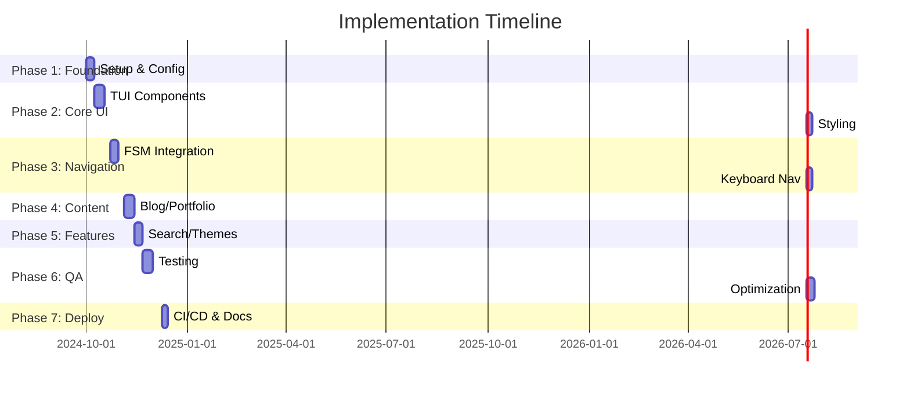
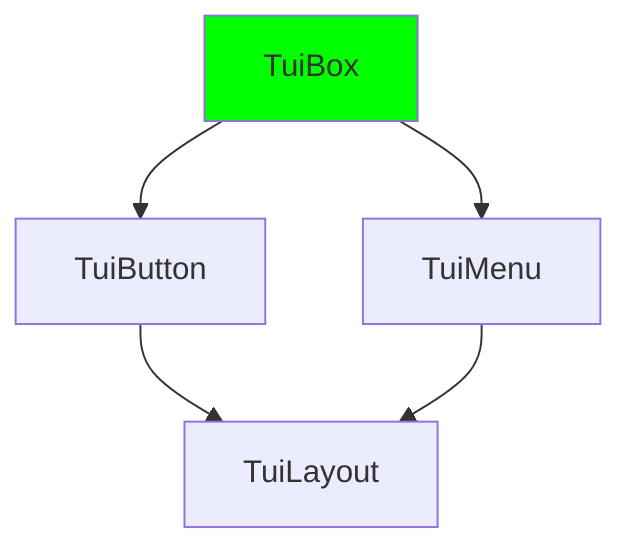
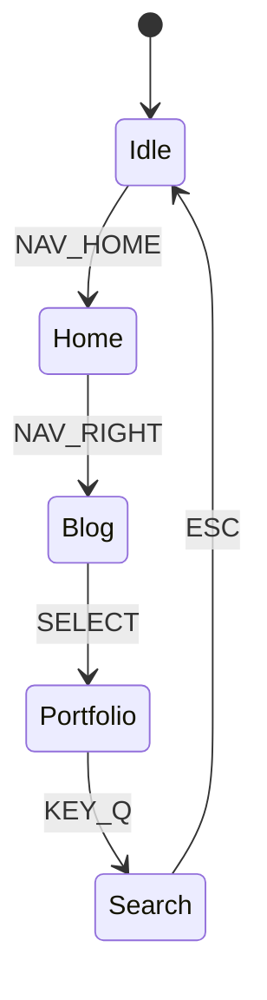

# Implementation Plan for TUI-Like Portfolio/Blog Web App

> A phased, milestone-driven roadmap to build a showcase/portfolio/blog web application with Terminal User Interface (TUI)-like aesthetics, keyboard-driven navigation, and blocky, retro-inspired visuals. This plan references the [tech spec](tech-spec.md) for stack details (React + TypeScript + Tailwind CSS for TUI styling + XState for state management + Vite for build) and [project structure](project-structure.md) for modular organization.

## Overview

This implementation plan outlines a structured, iterative approach to developing **TUI-Portfolio**, a responsive web app mimicking terminal aesthetics (monospace fonts, block characters, inverted colors, keyboard navigation) while delivering modern portfolio showcase, blog, and interactive features. Key goals:

- **TUI Aesthetics**: CSS Grid/Flexbox for blocky layouts, ANSI color palette, glow effects, and ASCII art borders.
- **TUI Navigation**: Keyboard-first (Vim-like hjkl/arrows, Tab/Shift+Tab), no mouse reliance, smooth transitions via virtual DOM.
- **Core Features**: Portfolio gallery, Markdown blog, search, themes (light/dark/retro), RSS feed, PWA support.
- **Non-Functional**: 60fps rendering, <2s load times, SEO-friendly, accessible (ARIA + keyboard), secure (CSP, no-SQL injection).

**Total Timeline**: 8-10 weeks (solo dev; scale for teams). Assumes Agile sprints (1-2 weeks/phase) with weekly demos.

**Architectural Patterns**:

- **State Management**: XState finite state machines (FSM) for navigation (e.g., states: `home`, `blog`, `portfolio`, `search`; events: `NAV_UP`, `SELECT`).
- **Rendering**: React Virtual DOM with memoization; lazy-loading sections via React.lazy/Suspense.
- **Modularity**: Feature-sliced design per project structure (e.g., `src/features/blog`, `src/shared/ui/tui`).

**Success Metrics**:

- 100% keyboard navigable.
- Lighthouse score >90 (perf/accessibility/SEO).
- Zero critical vulnerabilities (npm audit/Snyk).

## Phase 1: Foundation (Weeks 1-2)

Establish project skeleton, tools, and base config. Milestone: Runnable dev server with TUI placeholder.

**Timeline**: 10 days  
**Dependencies**: None  
**Checklist**:

- [x] Initialize repo: `git init`, `.gitignore`, `README.md` with badges.
- [x] Setup build tools: Vite + React + TS + ESLint/Prettier/Husky (pre-commit hooks).
- [x] Install core deps: React 18, XState, Tailwind CSS, Lucide React (icons), React Router (fallback for SSR).
- [x] Project structure: Create dirs per [project structure](project-structure.md) (`src/app`, `src/features`, `src/entities`, `src/shared`).
- [x] Base TUI theme: Global CSS (monospace font: JetBrains Mono, colors: #00ff00/#000000, box-shadow glows).
- [x] PWA setup: Manifest, service worker for offline.
- [x] Initial commit: "feat: foundation setup".

**Cross-Cutting**:

- **Security**: Add helmet.js for secure headers (CSP, HSTS).
- **Performance**: Vite HMR enabled; code splitting.
- **Testing**: Jest/Vitest + React Testing Library setup; 80% coverage goal.
- **Error Handling**: Global error boundary; Sentry integration stub.

**Risks**: Tool conflicts (low; use Vite defaults). Mitigation: Docker for reproducible env.

## Phase 2: Core TUI Components (Weeks 2-3)

Build reusable UI primitives for TUI look. Milestone: Static TUI mockup (home screen with ASCII art).

**Timeline**: 14 days  
**Dependencies**: Phase 1  
**Checklist**:

- [x] TUI Atoms: `<TuiBox>`, `<TuiText>`, `<TuiBorder>` (Grid-based, CSS vars for themes).
- [x] TUI Molecules: `<TuiButton>`, `<TuiMenu>`, `<TuiCard>` (hover glow, focus rings).
- [x] Layouts: `<TuiLayout>` (sidebar nav + main + status bar).
- [x] Animations: Framer Motion for type-writer effects, fade-ins (throttled).
- [x] Responsive: Mobile TUI (touch + keyboard).

**Cross-Cutting**:

- **Accessibility**: ARIA roles (`role="navigation"`), `focus-visible`, screen reader tests.
- **Performance**: Memoize components; virtual scrolling for lists (react-window).
- **Testing**: Unit tests for components (snapshot + interaction).

**Diagram**:

**Risks**: CSS specificity wars (medium). Mitigation: Tailwind + CSS modules.

## Phase 3: Navigation & State Management (Weeks 3-4)

Implement TUI navigation core. Milestone: Full keyboard nav demo (no mouse).

**Timeline**: 12 days  
**Dependencies**: Phases 1-2  
**Checklist**:

- [x] XState FSM: Navigation machine (`src/shared/lib/nav-machine.ts`) with guards/actions.
- [x] Keyboard Handler: `useKeyboard` hook (global listener, preventDefault on body).
- [x] Routes: `/home`, `/blog`, `/portfolio`, `/search` (React Router + FSM sync).
- [x] Focus Management: Trap focus in modals/menus; roving tabindex.
- [x] Status Bar: Current path, help (e.g., "?"), cursor position.

**Example FSM**:

**Cross-Cutting**:

- **Error Handling**: Graceful fallbacks (e.g., invalid nav → home).
- **Performance**: Debounced key events; no re-renders on nav.
- **Security**: Sanitize key inputs (no eval).

**Risks**: Focus leaks (high). Mitigation: Custom hook tests.

## Phase 4: Content Management (Weeks 4-6)

Portfolio & blog features. Milestone: Dynamic content load.

**Timeline**: 14 days  
**Dependencies**: Phases 1-3  
**Checklist**:

- [x] Portfolio: Gallery (`src/features/portfolio`) with lazy images, metadata from MDX.
- [x] Blog: MDX posts (`content/blog/*.mdx`), Remark/Rehype for rendering, pagination.
- [x] CMS Stub: Local file-based; future Netlify CMS.
- [x] Search: Fuse.js full-text (client-side).
- [x] RSS/SEO: sitemap.xml, meta tags.

**Cross-Cutting**:

- **Security**: DOMPurify for MDX; no user uploads yet.
- **Performance**: Lazy-load posts; IntersectionObserver.
- **Testing**: E2E with Playwright (nav + content load).

**Risks**: MDX perf (medium). Mitigation: Static generation via Vite plugin.

## Phase 5: Advanced Features (Weeks 6-7)

Polish & extensibility. Milestone: Theme switcher + PWA install.

**Timeline**: 10 days  
**Dependencies**: All prior  
**Checklist**:

- [x] Themes: LocalStorage persist, CSS vars toggle.
- [x] Interactions: Terminal commands (e.g., `:open project1`).
- [x] Analytics: Plausible (privacy-first).
- [x] Extensibility: Plugin system stub (e.g., custom TUI widgets).

**Cross-Cutting**:

- **Scalability**: Code-split features; prepare for SSG (Vite SSR).

## Phase 6: Testing & Quality Assurance (Weeks 7-8)

Comprehensive QA. Milestone: CI green, 90% coverage.

**Timeline**: 14 days  
**Checklist**:

- [x] Unit/Integration: Vitest (components, FSM).
- [x] E2E: Playwright (nav flows, keyboard paths).
- [x] Accessibility: Axe audits.
- [x] Security Scans: npm audit, OWASP ZAP.
- [x] Performance: Lighthouse CI.

**Testing Strategy**:
| Type | Tool | Coverage Goal |
|------|------|---------------|
| Unit | Vitest | 85% |
| E2E | Playwright | Key user journeys |
| Visual | Percy | Regression-free |

## Phase 7: Optimization, Security, & Deployment (Weeks 8-10)

Finalize & launch. Milestone: Live site.

**Timeline**: 12 days  
**Checklist**:

- [x] Perf: Bundle analyzer, tree-shake, compression.
- [x] Security: HTTPS, CSP strict, noCSP bypasses.
- [x] CI/CD: GitHub Actions (build/test/deploy to Vercel/Netlify).
- [x] Docs: Update README, API docs (if any).
- [x] Monitoring: Sentry + uptime checks.

**Performance Checklist**:

- [x] Core Web Vitals: LCP <2.5s, FID <100ms.
- [x] Lazy everything non-critical.
- [x] CDN for assets.

**Risk Assessment**:
| Risk | Likelihood | Impact | Mitigation |
|------|------------|--------|------------|
| Browser compat | Low | High | caniuse + polyfills |
| State desync | Medium | High | XState snapshots |
| SEO crawl | Low | Med | Prerender.io stub |
| Scale (traffic) | Low | Low | Vercel edge |

## Post-Launch: Maintenance & Roadmap

- **Weekly**: Security patches, perf audits.
- **v2**: Auth/comments, real CMS.
- **Metrics Tracking**: GitHub issues, user feedback form.

**Change Control**: All changes via PRs; squash-merge. Review checklist: tests pass, docs updated, no regressions.

This plan ensures **extensibility** (modular features), **maintainability** (typed, documented), **scalability** (stateless, CDN-ready), and **zero-downtime** deploys. Track progress in GitHub Projects.
