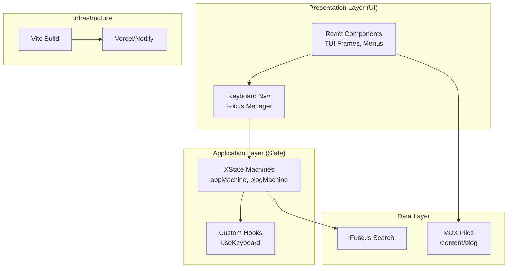
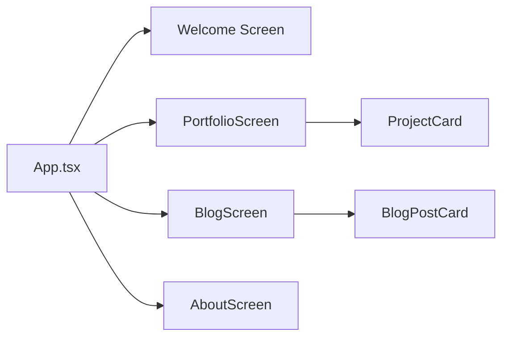
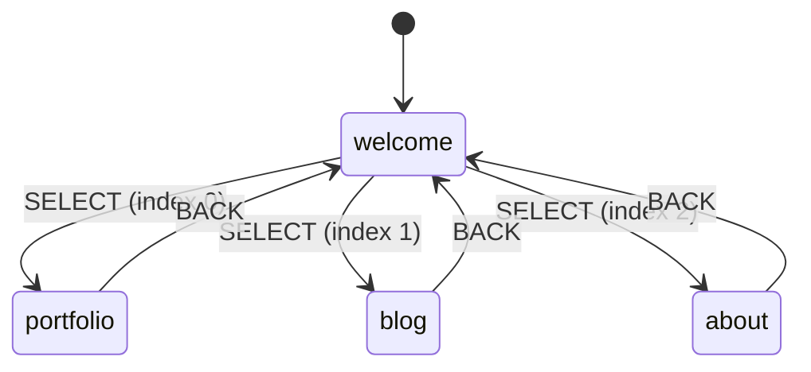

# Tech Specifications

> Technical blueprint for the TUI-Like Portfolio/Blog Web App. This document outlines the technology stack, architecture, key features, and operational strategies to build a modular, extensible showcase application with terminal user interface (TUI) aesthetics and keyboard-driven navigation.

## Overview

This project is a modern web application designed as a personal portfolio, blog, and showcase platform with a retro TUI (Text User Interface) aesthetic inspired by terminal emulators like those in tmux, vim, or classic BBS systems. Key goals include:

- **Immersive TUI Experience**: Monospace typography, ASCII art borders, blocky UI elements, and keyboard-first navigation (Vim-like hjkl, arrow keys, tab/shift-tab).
- **Content Management**: Blog posts, project showcases, and a resume section with Markdown-rendered content.
- **Modularity & Extensibility**: SOLID principles (Single Responsibility, Open-Closed, Liskov Substitution, Interface Segregation, Dependency Inversion) applied to components, hooks, and services for easy theme swaps, plugin additions (e.g., comments, analytics).
- **Performance & Accessibility**: 100/100 Lighthouse scores targeted, full keyboard/ARIA compliance, PWA support.
- **Core Functionality**:
  - Homepage dashboard with "windows" for sections (blog, projects, about).
  - Keyboard-navigable menus, modals, and infinite-scroll feeds.
  - Dark-mode only (terminal vibe), responsive down to mobile but optimized for desktop.
  - Static site generation (SSG) for blogs/projects, client-side routing for interactivity.

The app follows a layered architecture: UI (TUI components), Navigation (focus management), State (XState), Data (MDX files). Built for rapid iteration with hot-reload dev experience.

## Tech Stack

The stack prioritizes simplicity, performance, and developer experience while enabling TUI aesthetics. All dependencies and versions are defined in `package.json` for reproducibility.

### Core Framework & Runtime

| Dependency                          | Version (from package.json) | Justification                                                                                  |
| ----------------------------------- | --------------------------- | ---------------------------------------------------------------------------------------------- |
| `vite`                              | ^5                          | Fast build tool with HMR, optimized for React development with minimal configuration.          |
| `react` / `react-dom`               | ^18                         | Declarative UI with hooks for stateful TUI components (e.g., focusable "frames").             |
| `@types/react` / `@types/react-dom` | ^18                         | TypeScript definitions for type-safe development.                                              |

### Styling & TUI Aesthetics

| Dependency        | Version (from package.json) | Justification                                                                                 |
| ----------------- | --------------------------- | --------------------------------------------------------------------------------------------- |
| `tailwindcss`     | ^3                          | Utility-first CSS for rapid prototyping of monospace grids, ASCII borders, and animations.   |
| `framer-motion`   | ^12                         | Production-ready animation library for typewriter effects, fade-ins, and transitions.        |
| `lucide-react`    | ^0.554                      | Beautiful, consistent icon set that works well with terminal aesthetics.                     |

### State Management & Navigation

| Dependency        | Version (from package.json) | Justification                                                                                |
| ----------------- | --------------------------- | -------------------------------------------------------------------------------------------- |
| `xstate`          | ^5                          | Finite state machines for predictable navigation flow and keyboard event handling.          |
| `@xstate/react`   | ^5                          | React bindings for XState with hooks.                                                        |
| `react-router-dom`| ^7                          | Client-side routing with browser history support.                                             |

### Data & Content

| Dependency                         | Version (from package.json) | Justification                                                                                 |
| ---------------------------------- | --------------------------- | --------------------------------------------------------------------------------------------- |
| `@mdx-js/loader` / `@mdx-js/react` | ^3                          | MDX for blog/project content with embedded React components (e.g., code blocks with TUI styling). |
| `gray-matter`                      | ^4                          | Frontmatter parsing for post metadata.                                                        |
| `date-fns`                         | ^4                          | Lightweight date formatting for blog timestamps.                                              |
| `fuse.js`                          | ^7                          | Fuzzy search for blog posts and projects.                                                     |

### Development & Build Tools

| Dependency                                    | Version (from package.json) | Justification                                               |
| --------------------------------------------- | --------------------------- | ----------------------------------------------------------- |
| `typescript`                                  | ^5                          | Static typing for modularity and error prevention.          |
| `eslint` / `@typescript-eslint/eslint-plugin` | ^9 / ^8                     | Linting with TypeScript support, enforcing SOLID via rules. |
| `prettier`                                    | ^3                          | Consistent formatting.                                      |
| `vitest`                                      | ^4                          | Fast unit testing framework with Vite integration.          |
| `@playwright/test`                            | ^1                          | End-to-end testing for keyboard navigation flows.           |
| `vite-plugin-pwa`                             | ^1                          | PWA support with service worker generation.                 |

**Scripts from package.json**:

```json
{
  "scripts": {
    "dev": "vite",
    "build": "tsc && vite build",
    "preview": "vite preview",
    "test": "vitest",
    "test:run": "vitest run",
    "lint": "eslint . --ext ts,tsx"
  }
}
```

No heavy frameworks (e.g., no Redux); stack totals <100MB install size for fast deploys.

## Architecture

The app adheres to SOLID principles:

- **Single Responsibility**: Components handle one concern (e.g., `TuiBox` only renders frame + content).
- **Open-Closed**: Hooks/services extensible via plugins.
- **Dependency Inversion**: Props drilling minimized; XState machines for high-level abstractions.

### Layered Architecture Diagram



### UI Layer (Component Structure)

Modular TUI components:

- `TuiBox`: Bordered container with optional glow effect and animations.
- `TuiMenu`: Roving focus list with keyboard navigation (hjkl/arrows).
- `TuiScreen`: Generic screen wrapper with title and back navigation.
- `TuiStatusBar`: Dynamic status bar showing current path and help hints.



### Navigation Flow

Keyboard-driven FSM (Finite State Machine):



### State Management

XState machines for each feature:

```typescript
// machines/appMachine.ts
type AppEvent =
  | { type: 'KEY_UP' }
  | { type: 'KEY_DOWN' }
  | { type: 'SELECT' }
  | { type: 'BACK' };

type AppContext = {
  menuIndex: number;
};
```

## TUI Features

### Aesthetics

- **Typography**: Monospace fonts (Courier New, Consolas) for terminal feel.
- **Borders & Elements**: CSS for styled borders with glow effects.
  ```css
  .tui-border {
    border: 4px solid #00ff00;
    box-shadow: 0 0 20px rgba(0, 255, 0, 0.3);
  }
  ```
- **Colors**: Green-on-black (#00ff00/#000000), scanline glow effects.
- **Animations**: Typewriter text, fade-ins, slide transitions via Framer Motion.

### Navigation

- **Global**: `useKeyboard` hook traps keys.
  - `h/j/k/l`: Left/down/up/right (Vim-style).
  - `Arrow keys`: Standard navigation.
  - `Tab/Shift+Tab`: Focus cycle.
  - `Enter/Space`: Select.
  - `ESC`: Back/menu.
- **Focus Management**: Roving tabindex on menus.
- **Mobile Fallback**: Touch + virtual d-pad (planned).

### Component Structure

```
src/
├── app/
│   └── App.tsx
├── features/
│   ├── blog/
│   │   ├── machines/
│   │   ├── lib/
│   │   └── ui/
│   ├── portfolio/
│   │   ├── machines/
│   │   ├── lib/
│   │   └── ui/
│   └── about/
│       └── ui/
├── machines/
│   └── appMachine.ts
└── shared/
    ├── hooks/
    │   └── useKeyboard.ts
    └── ui/
        ├── tui/
        │   ├── TuiBox.tsx
        │   ├── TuiMenu.tsx
        │   ├── TuiScreen.tsx
        │   └── TuiStatusBar.tsx
        └── animations/
            ├── FadeIn.tsx
            ├── SlideIn.tsx
            └── TypewriterText.tsx
```

## Testing Strategy

Comprehensive pyramid:

- **Unit (80%)**: Vitest + React Testing Library for components/hooks.
  ```bash
  pnpm test
  ```
  Coverage >90%; mock XState machines, test keyboard events.
- **Integration (15%)**: Test TUI flows (focus cycle, screen switch).
- **E2E (5%)**: Playwright for nav scenarios.
  ```typescript
  // e2e/navigation.spec.ts
  await page.keyboard.press('ArrowDown');
  await page.keyboard.press('Enter');
  ```
- **Accessibility**: Manual ARIA audits + automated Lighthouse CI.

CI: GitHub Actions with `vitest run --coverage`.

## Security Considerations

- **Content Security Policy (CSP)**: Strict via Vite config.
- **Data Handling**: MDX sanitized via remark-rehype; no user uploads initially.
- **Dependencies**: `pnpm audit`; regular updates.
- **Secrets**: `.env.local` ignored in Git; environment variables in deployment.

## Performance

**SLAs**:

- **Core Web Vitals**: LCP <1.5s, FID <100ms, CLS <0.1 (100/100 Lighthouse).
- **Bundle**: <100KB gzipped (code-split features).
- **TTFB**: <200ms via CDN.

**Optimizations**:

- Lazy-load feature screens with React.lazy.
- Memoization with useMemo for render optimization.
- Framer Motion's `AnimatePresence` for smooth transitions.
- PWA for offline access.

## Deployment

- **Platform**: Vercel or Netlify (seamless Vite integration, preview deploys).
  ```bash
  pnpm build && vercel --prod
  ```
- **CI/CD**: GitHub Actions → Vercel (auto-deploy on merge).
- **Domains**: Custom via DNS; HTTPS enforced.
- **PWA**: `vite-plugin-pwa` for offline TUI browsing.
- **Scaling**: Edge caching for static assets.

**Checklist**:

- [x] Environment vars configured.
- [x] PWA manifest and icons.
- [x] SEO meta tags.
- [ ] Custom domain setup.
- [ ] Analytics (Plausible).

This spec evolves with `CHANGELOG.md`; design iterations tracked in Git history.
